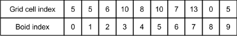
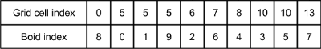
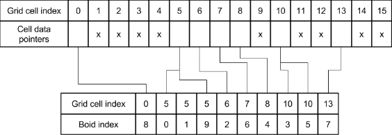
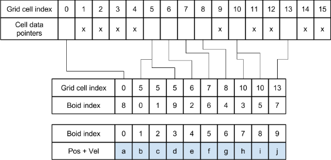

**University of Pennsylvania, CIS 5650: GPU Programming and Architecture,
Project 1 - Flocking**

* Michael Rabbitz
  * [LinkedIn](https://www.linkedin.com/in/mike-rabbitz)
* Tested on: Windows 10, i7-9750H @ 2.60GHz 32GB, RTX 2060 6GB (Personal)

## Part 1: Introduction

In the Boids flocking simulation, particles representing birds or fish
(boids) move around the simulation space according to three rules:

1. **Cohesion** - boids move towards the perceived center of mass of their neighbors
2. **Separation** - boids avoid getting to close to their neighbors
3. **Alignment** - boids generally try to move with the same direction and speed as
their neighbors

These three rules specify a boid's velocity change in a timestep.
At every timestep, a boid thus has to look at each of its neighboring boids
and compute the velocity change contribution from each of the three rules.

The implemented algorithm for the three rules is based on [Conard Parker's notes](http://www.vergenet.net/~conrad/boids/pseudocode.html)
with slight adaptations. For the purposes of an interesting simulation,
we will say that two boids only influence each other by a given rule if they
are within the rule's **neighborhood distance** of each other, respectively.

Below are two outputs from the simulation, slowed down for easier viewing:

|25,000 Boid Count|
|:--:|
||

|500,000 Boid Count|
|:--:|
||

## Part 2: Implementation Details
Three methods of implementation were used to exemplify the GPU's performance under various conditions:

##### Method 1: Naive Neighbor Search
A given boid iterates through every other boid to check if their distance falls within the neighborhood distance defined by any of the three rules.
For each applicable rule, it calculates how the given boid's velocity should change based on that rule’s criteria.

##### Method 2: Uniform Grid Scattered Neighbor Search
In a preprocess step, "bin" the boids into a **uniform spatial grid** data structure.
In this step, we utilize four buffers:
1. Buffer containing a pointer for each boid to its position and velocity data
2. Buffer containing the grid index of each boid
3. Buffer containing a pointer for each cell to the beginning of its data in Buffer 1
4. Buffer containing a pointer for each cell to the end of its data in Buffer 1

We first populate Buffer 1 and Buffer 2 will look something like this, where Grid cell index is Buffer 2 and Boid index is Buffer 1:

Next, we sort Buffer 2 by grid index, and Buffer 1 is simultaneously rearranged by the sorting of Buffer 2.
Buffer 1 and Buffer 2 will now look something like this, where Grid cell index is Buffer 2 and Boid index is Buffer 1:

Lastly, we populate Buffers 3 and 4, which combined, will look this this, where Cell data pointers is Buffers 3 and 4 combined:

Given that the actual boid data was never rearranged, we use Buffer 1 to "reach" for the boid data that is scattered in memory relative to Buffer 1 and Buffer 2.
This gives us the full picture, where Grid cell index is Buffer 2, Boid index is Buffer 1, Cell data pointers is Buffers 3 and 4 combined, and Pos + Vel is the boid data.

To summarize, pointers to boids in a single cell are contiguous in memory, but the boid data itself (velocities and positions) is scattered all over the place. Hence, the "Scattered" in Uniform Grid Scattered Neighbor Search.

After the preprocess step, we then perform the calculations to update the boids.

To determine how many cells to check around a given boid, first compute a ratio by dividing
twice the maximum neighborhood distance of the three rules by the cell width of the grid.
This ratio helps determine how many cells to check in each dimension relative to the cell containing the given boid.

For example, if the maximum neighborhood distance is 5 and the cell width is 10, the ratio is (2 * 5) / 10 = 1.
This indicates that you should check the cell containing the given boid, as well as the cells adjacent to it with an offset of ±1 in each dimension.
In this example, this covers the boid’s cell plus 26 neighboring cells, resulting in a total of 27 cells.

You then iterate through the boids contained in these cells to perform the necessary calculations.

**During this iteration is where we use Buffer 1 to "reach" for the boid data that is scattered in memory relative to Buffer 1 and Buffer 2.**

##### Method 3: Uniform Grid Coherent Neighbor Search
Everything is the same as Method 2, except we eliminate the use of Buffer 1 to "reach" for the boid data that is scattered in memory relative to Buffer 1 and Buffer 2.
rearranging the boid data itself so that all the velocities and positions of boids in one cell are also contiguous in memory, so this data can be accessed directly using Buffers 3 and 4.

This is full picture, where Grid cell index is Buffer 2, and Cell data pointers is Buffers 3 and 4 combined, and Pos + Vel is the boid data.

#### Grid-Looping Optimization for Methods 2 and 3:
Initially, we determined how many ccells to check around a given boid by computing a ratio by dividing twice the maximum neighborhood distance of the three rules by the cell width of the grid.
The given boid's cell += the ratio in each dimension end up being the cells that contain the boids we need to iterate through for our calculations.

We took this a step further calculating the closest point of each of these cells to the given boid's position, and checking if the result is within the the maximum neighborhood distance of the three rules.
If not, we dont consider the cell for iterating through its contained boids for calculating the given boid's velocity update.

We determine the closest point of a cell to the given boid's position by clamping the boid's position to the x, y, and z bounds of the cell, then subtracting the boid's position from this closest point of the cell.

## Part 3: Performance Analysis
