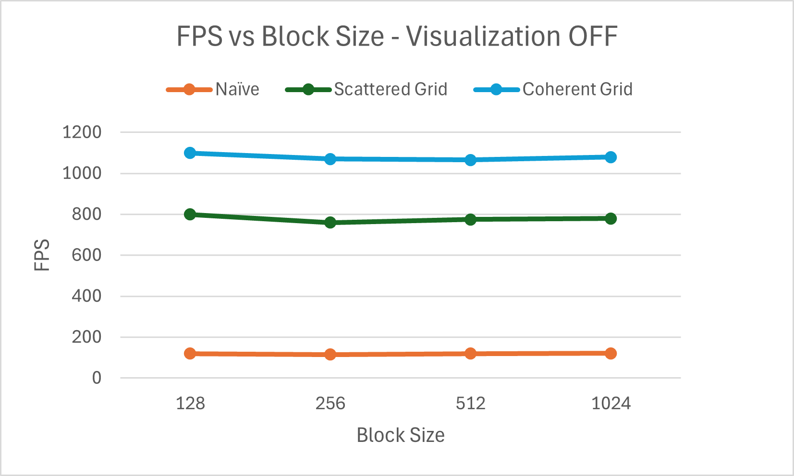

**University of Pennsylvania, CIS 5650: GPU Programming and Architecture,
Project 1 - Flocking**

* Michael Rabbitz
  * [LinkedIn](https://www.linkedin.com/in/mike-rabbitz)
* Tested on: Windows 10, i7-9750H @ 2.60GHz 32GB, RTX 2060 6GB (Personal)

## Part 1: Introduction

In the Boids flocking simulation, particles representing birds or fish
(boids) move around the simulation space according to three rules:

1. **Cohesion** - boids move towards the perceived center of mass of their neighbors
2. **Separation** - boids avoid getting to close to their neighbors
3. **Alignment** - boids generally try to move with the same direction and speed as
their neighbors

These three rules specify a boid's velocity change in a timestep.
At every timestep, a boid thus has to look at each of its neighboring boids
and compute the velocity change contribution from each of the three rules.

The implemented algorithm for the three rules is based on [Conard Parker's notes](http://www.vergenet.net/~conrad/boids/pseudocode.html)
with slight adaptations. For the purposes of an interesting simulation,
we will say that two boids only influence each other by a given rule if they
are within the rule's **neighborhood distance** of each other, respectively.

Below are two outputs from the simulation, slowed down for easier viewing:

|25,000 Boid Count|
|:--:|
||

|500,000 Boid Count|
|:--:|
||

## Part 2: Implementation Details
Three methods of implementation were used to highlight their respective performance implications.

##### Method 1: Naive Neighbor Search
A given boid iterates through every other boid in the simulation to check if their distance falls within the neighborhood distance defined by any of the three rules.
For each applicable rule, the given boid's velocity change is calculated based on that rule’s criteria.

##### Method 2: Uniform Grid Scattered Neighbor Search
In a preprocess step, "bin" the boids into a **uniform spatial grid** data structure.
With the clever use of a few buffers, this means that pointers to boids within the same grid cell are contiguous in memory.
However, the boid data itself (velocities and positions) is scattered all over the place. Hence, the "Scattered" in Uniform Grid Scattered Neighbor Search.

After the preprocess step, we then perform the calculations to update a given boid's data by only considering other boids that are in nearby grid cells.

To determine which cells to utilize for a given boid, first compute a ratio by dividing
(twice the maximum neighborhood distance of the three boid rules) by (the cell width of the grid).
The given boid's cell += the ratio in each dimension are the cells that contain the boids we need to iterate through for our calculations.

For example, if the maximum neighborhood distance is 5 and the cell width is 10, the ratio is (2 * 5) / 10 = 1.
This indicates that you should check the cell containing the given boid, as well as the cells adjacent to it with an offset of ±1 in each dimension.
In this example, this covers the boid’s cell plus 26 neighboring cells, resulting in a total of 27 cells.

You then iterate through the boids contained in these cells to perform the necessary calculations.

*During this iteration is where we "reach" for the boid data that is scattered in memory.*

##### Method 3: Uniform Grid Coherent Neighbor Search
Everything is the same as Method 2, except we eliminate the "reach" for the boid data that is scattered in memory.
We do this by rearranging the boid data itself so that all the velocities and positions of boids in the same grid cell are also contiguous in memory.

#### Grid-Looping Optimization for Methods 2 and 3:
Method 2's description shows how for a given boid, we determine the cells that contain the boids we need to iterate through for our calculations.

We took this a step further calculating the closest point of each of these cells to the given boid's position, and checking if the result is within the the maximum neighborhood distance of the three boid rules.
If it is not, we no longer consider the boids in that cell.

We determine the closest point of a cell to the given boid's position by clamping the boid's position to the x, y, and z bounds of the cell, then subtracting the boid's position from this closest point of the cell.

## Part 3: Performance Analysis
Frames Per Second (FPS) will be the measurment of performance within this section.

FPS is measured using the GLFW timer.

In cases where Visualization of the boids is disabled, the framerate reported will be for the the simulation only.

### Part 3.1: FPS vs Boid Count
Fixed block size of 128 threads per block

| # Boids   | Naive FPS | Scattered Grid FPS | Coherent Grid FPS |
| --------- | --------- | ------------------ | ----------------- |
| 5,000     | 900       | 1100               | 1100              |
| 25,000    | 120       | 800                | 1100              |
| 50,000    | 35        | 500                | 880               |
| 125,000   | 6         | 168                | 465               |
| 500,000   | N/A       | 6                  | 110               |
| 1,000,000 | N/A       | 2                  | 33                |

| # Boids   | Naive FPS | Scattered Grid FPS | Coherent Grid FPS |
| --------- | --------- | ------------------ | ----------------- |
| 5,000     | 490       | 565                | 560               |
| 25,000    | 110       | 485                | 560               |
| 50,000    | 34        | 380                | 515               |
| 125,000   | 6         | 140                | 345               |
| 500,000   | N/A       | 5                  | 97                |
| 1,000,000 | N/A       | 1                  | 31                |

### Part 3.2: FPS vs Block Size
Fixed boid count of 25,000

| Block Size | Naive FPS | Scattered Grid FPS | Coherent Grid FPS |
| ---------- | --------- | ------------------ | ----------------- |
| 128        | 120       | 800                | 1100              |
| 256        | 115       | 760                | 1070              |
| 512        | 120       | 775                | 1065              |
| 1,024      | 121       | 780                | 1080              |

